## Unity Shader GetIn

This is a personal exercise and implementation of "getting started with Unity Shader". Some of the content may be slightly different from that in the book. The implementation platform is Unity 2018.4.2f1 (64-bit).

## Examples
### 漫反射

| 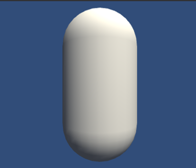  | 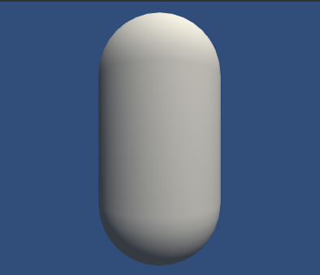 | 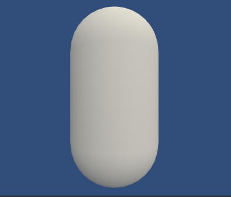 |
|:----------:|:---:|:--------:|
| 逐顶点反射  | 逐像素反射 | 半兰伯特反射    | 

### 高光反射

| 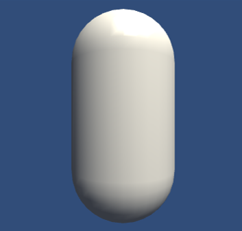  | 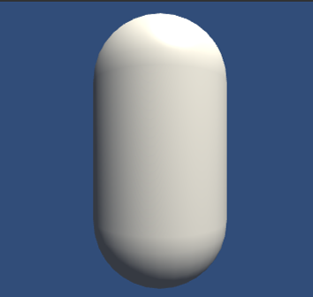 | 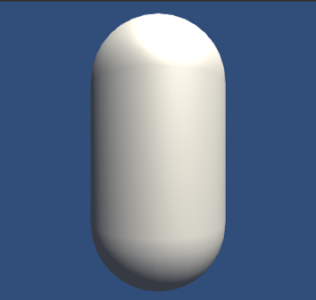 |
|:----------:|:---:|:--------:|
| 逐顶点高光反射（亮斑不连续）  | 逐像素高光反射（完整phong模型） | BlinnPhong(具有更亮的视觉效果)| 

### 法向纹理贴图

| 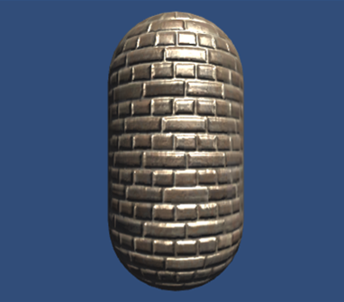  | 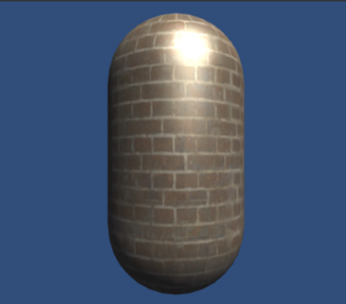 | 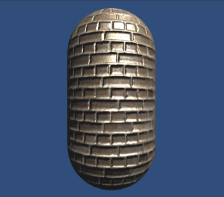 |
|:----------:|:---:|:--------:|
| Bump Scale = -1  | Bump Scale = 0 | Bump Scale = 1| 

### 渐进纹理控制光照效果

| 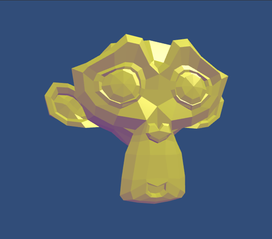  | 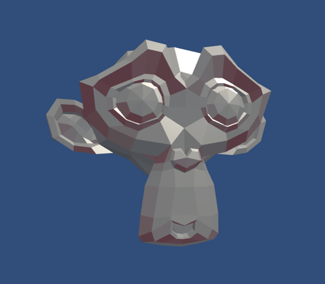 | 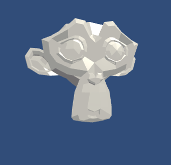 |
|:----------:|:---:|:--------:|
| 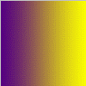  | 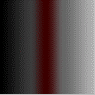 | 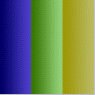 |

### 增加遮罩的高光反射

|   | 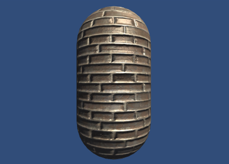 |
|:----------:|:---:|
| 漫反射+未遮罩的高光反射 | 漫反射+遮罩的高光反射 |

### AlphaTest的单面和双面透明效果

| 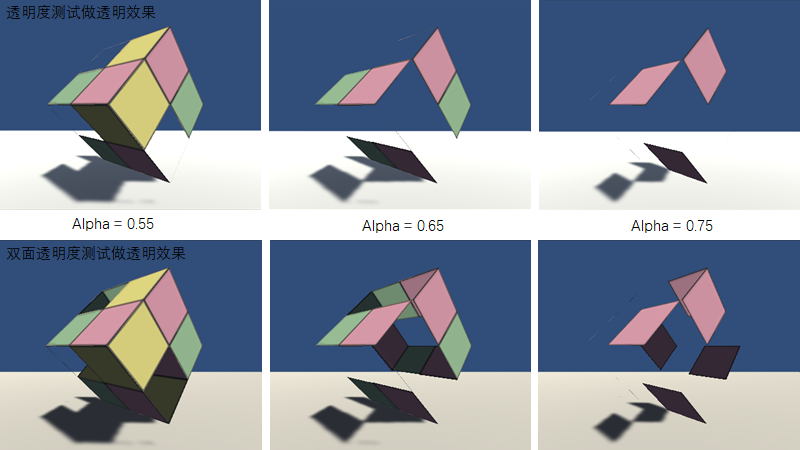  |
|:----------:|

### AlphaBlend的单面和双面透明效果

| 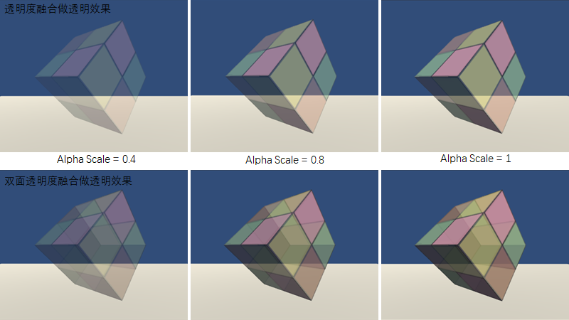  |
|:----------:|
### 两个Pass的妙用

| 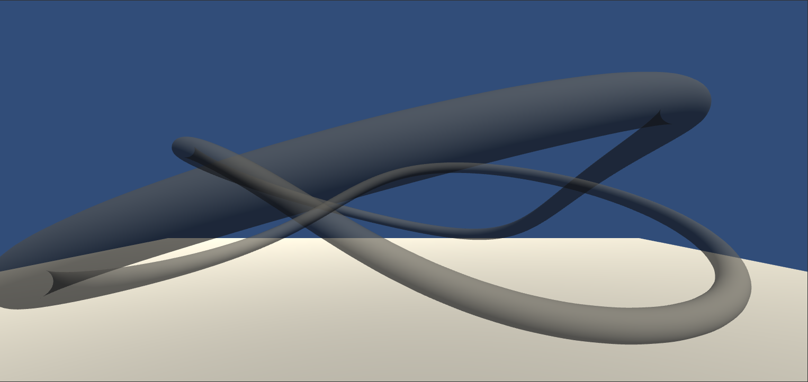  | 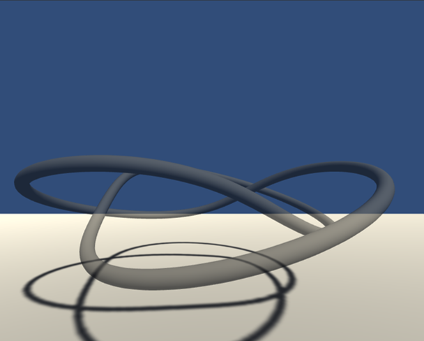 |
|:-------:|:---:|
模型本身具有复杂的遮挡关系，则因排序错误产生错误的透明效果。使用两个Pass可以解决这个问题其中第二个Pass与原始blend相同，而第一个Pass仅仅将模型深度值写入深度缓冲，而不输出颜色

### 前向渲染-光照衰减

| 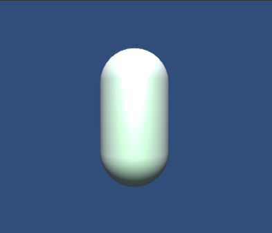  | 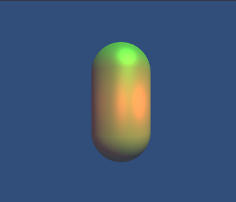 | 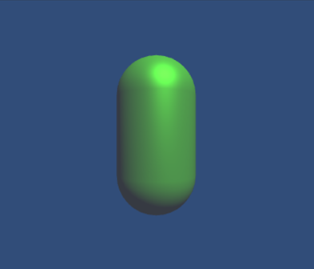 |
|:----------:|:---:|:--------:|
| Base + Additional Pass  | LightMode : Auto | LightMode : NotImportant| 

### 前向渲染-阴影

| 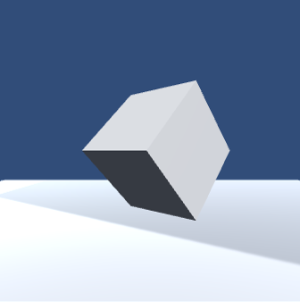  | 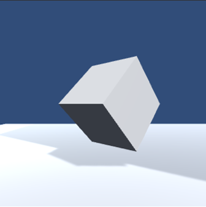 | 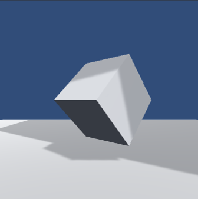 |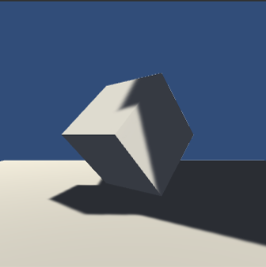|
|:-------:|:---:|:--------:|:-----:|
| No FallBack  | Only Fallback | Fall +(*shadow) |UNITY_LIGHT_ATTENUATION实现| 

### 透明效果+阴影效果的叠加

| 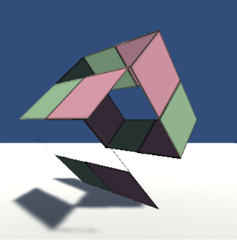  | 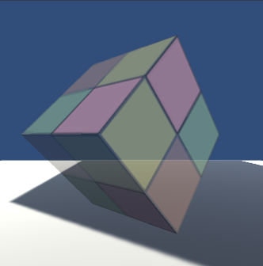 | 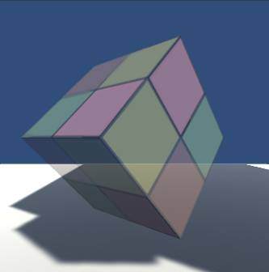 |
|:----------:|:---:|:--------:|
| AlphaTest, Shadow正常  | AlphaBlend,没有shadow |AlphaBlend+强制Fallback设置为Vertexlit| 

### cubemap的创作

| 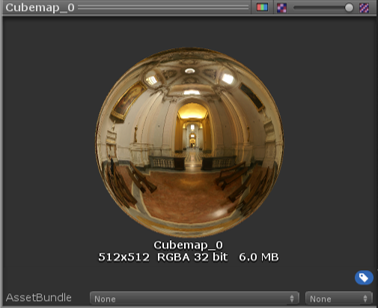  | 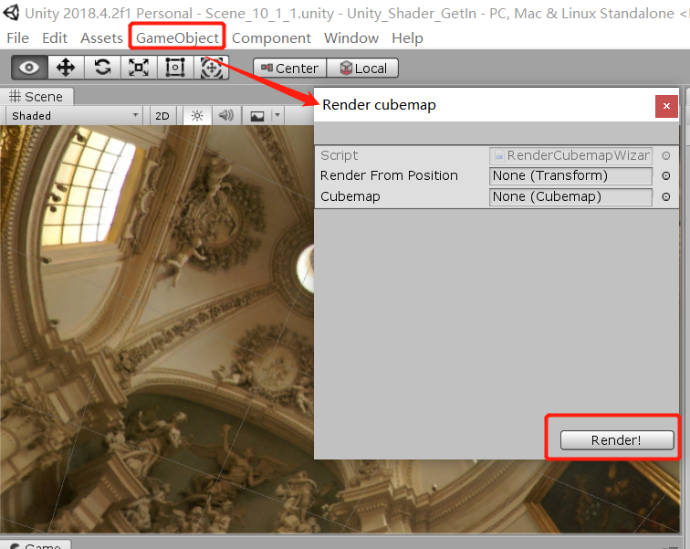 | 
|:----------:|:---:|

### 反射与折射的实现

| 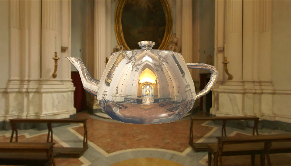  | 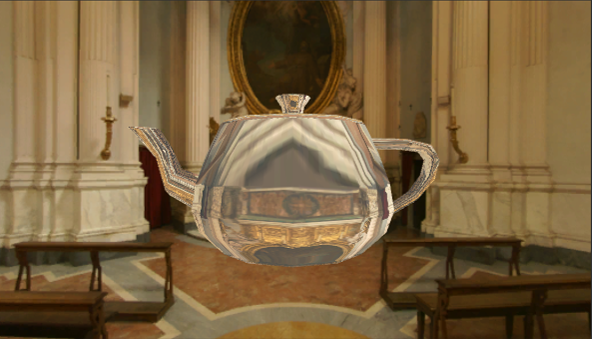 | 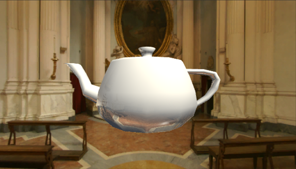 |
|:----------:|:---:|:--------:|
| 反射|折射|菲涅尔反射| 

### 镜面反射

|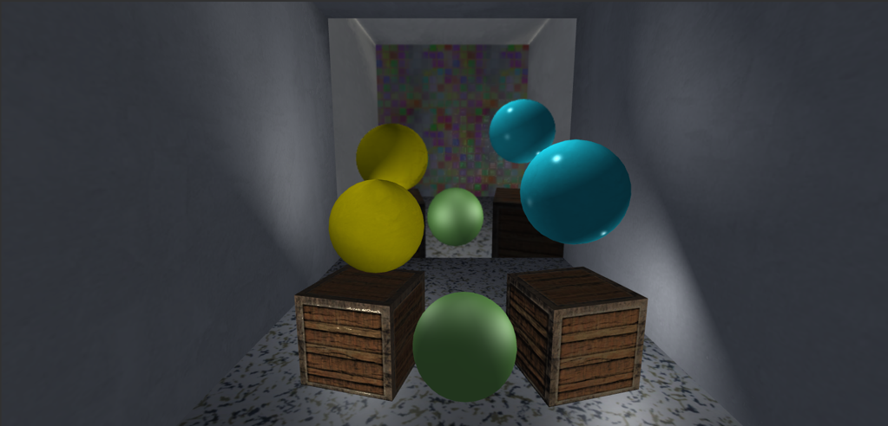|
|:--------:|

### 折射与反射的叠加效果

| 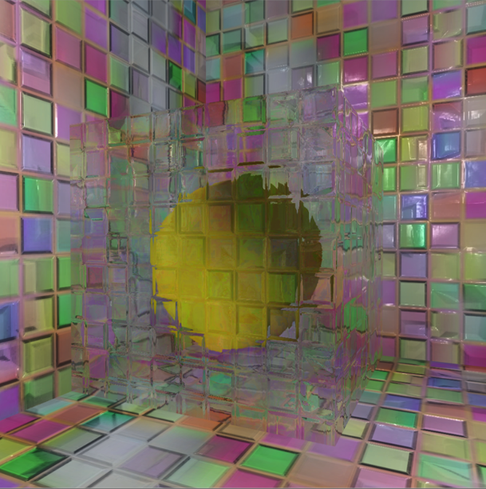  | 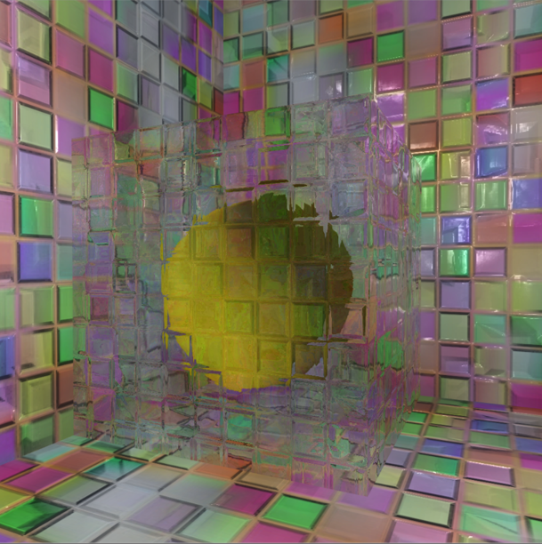 |
|:---:|:--------:|
使用rendertoCubemap的先后顺序会造成不同效果，观察可知，前者的纹理较为透亮，而后者有些混沌

### 程序纹理

| 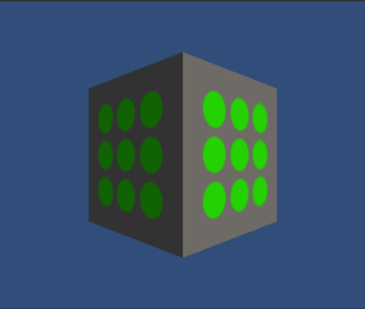  | 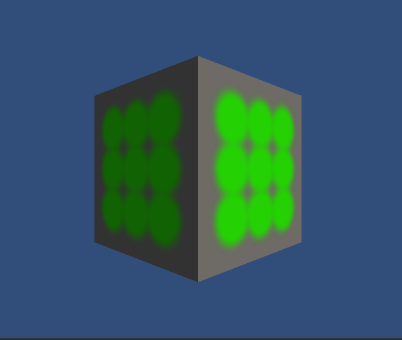 | 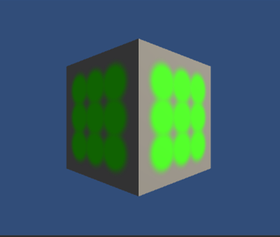 |
|:----------:|:---:|:--------:|
可通过参数控制圆形纹理的亮度，大小，颜色和模糊程度

### 纹理动画

| 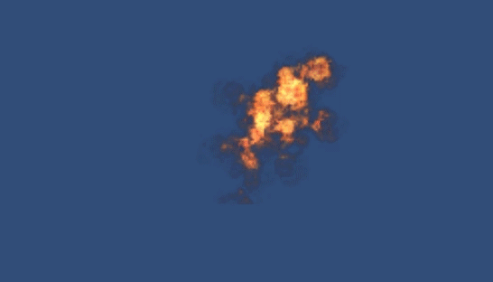  |  |
|:---:|:--------:|

### 屏幕后处理之调整屏幕亮度，颜色饱和度和对比度

| 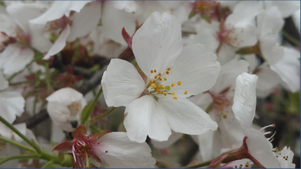  | 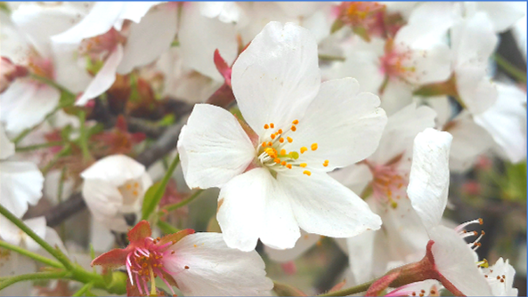 |
|:---:|:--------:|

### 屏幕后处理之Sobel算子做边缘检测

| 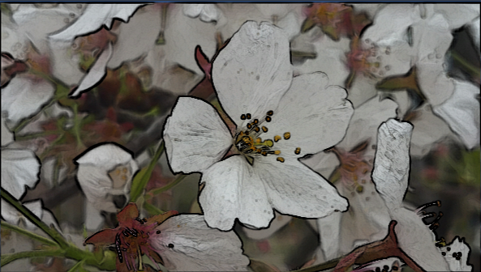  | 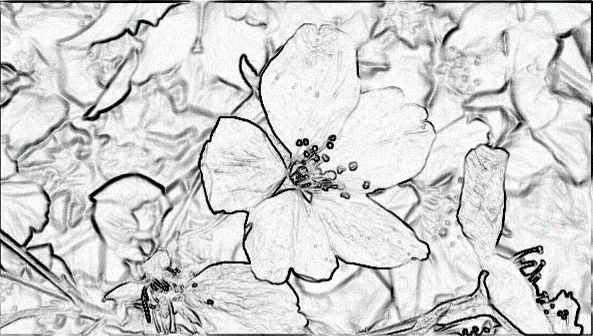 |
|:---:|:--------:|
EdgesOnly在原图和纯色之前插值得到最终像素值

### 屏幕后处理之高斯模糊

| 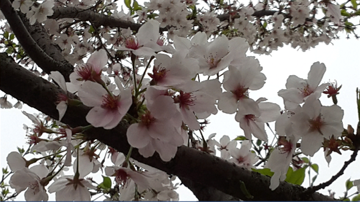  | 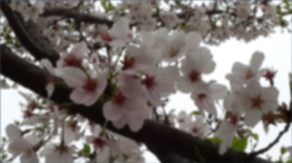 | 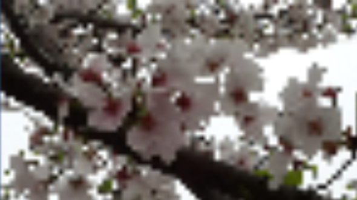 |
|:----------:|:---:|:--------:|
其中最右侧为下采样尺度太大时造成的问题：像素化

### 屏幕后处理之Bloom效果

|   | 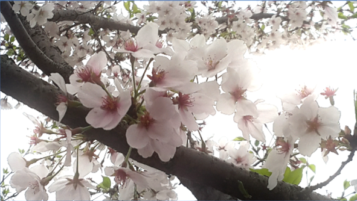 |
|:---:|:--------:|
在高斯模糊的基础上完成

### 运用累计缓存和深度纹理分别实现运动模糊

|   |  |
|:---:|:--------:|

|   |  |
|:---:|:--------:|
|累计缓存实现|深度纹理实现|

### 基于深度纹理，使用Roberts算子的边缘检测

|   |  |
|:---:|:--------:|
### 非真实干渲染

|   |  |
|:---:|:--------:|

### 素描渲染
|   |
|:--------:|

### 消融效果

|   |
|:--------:|

### 水面渲染

|   |
|:--------:|

### 基于深度纹理+噪声实现动态烟雾

|   |
|:--------:|

